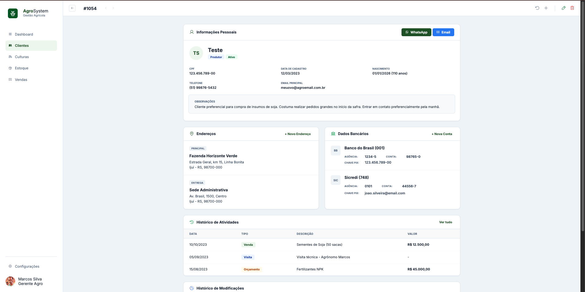
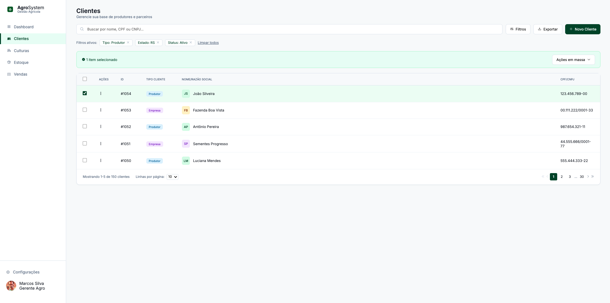

# 🚜 AgroSystem - Dashboard

Projeto de interface para gerenciamento agrícola desenvolvido para prática de layout e organização de código.

### 🛠 Tecnologias utilizadas:
- HTML5
- CSS3
- Phosphor Icons
- Google Fonts (Inter)

### 🖥️ Resultado do Projeto
| Vista da Tela 1 | Vista da Tela 2 |
| :---: | :---: |
|  |  |

### 📁 Como visualizar:
O projeto está estruturado em pastas. O arquivo principal de visualização é o `src/index.html`.
